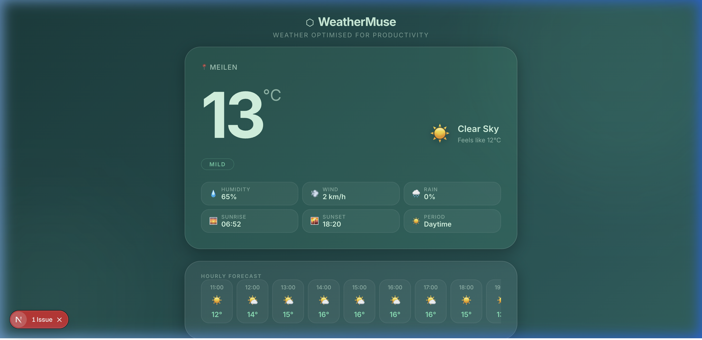
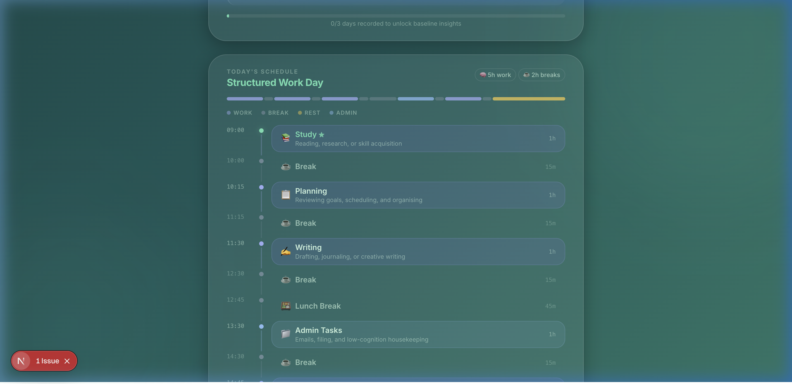

<div align="center">

# ⬡ WeatherMuse

### *Weather optimised for productivity.*

**WeatherMuse transforms your local forecast into a fully structured workday** — task priorities, a time-block schedule, smart weather alerts, and a personal productivity baseline, all generated automatically from live weather data.

[](https://nextjs.org/)
[](https://www.typescriptlang.org/)
[](#testing)
[](https://open-meteo.com/)
[](#run-locally)

<br/>



*Live dashboard — 13°C clear sky day in Meilen, Switzerland*

</div>

---

## What It Does

Instead of:
> *"Rainy, 6°C."*

WeatherMuse outputs:
> *"🎯 Deep Focus Day — 80% confidence. Schedule 90-min deep-work blocks from 09:00. Rain clears at 14:00 — good window for errands. ↑ 12% above your 7-day average."*

**Live inputs:**  geolocation → Open-Meteo hourly forecast  
**Live outputs:** Productivity signal · Confidence band · Task cards · Time-block schedule · Weather alerts · Personal baseline delta

---

## Feature Showcase

<div align="center">



*Adaptive daily schedule — weather-driven task ordering with auto-inserted breaks*

</div>

### All Panels at a Glance

| Panel | What it shows |
|---|---|
| 🌤 **Weather Card** | Temperature, condition, feels-like, humidity/wind/rain stats, sunrise/sunset |
| 📊 **Productivity Signal** | Focus score (0–100%), outdoor viability, signal label, confidence band (high/medium/low), ±uncertainty |
| 🎯 **Task Suggestions** | 12 weighted task categories ranked by today's signal (Deep Work, Exercise, Errands…) |
| 🗓 **Today's Schedule** | Full 09:00–18:00 time-block timeline with adaptive durations, breaks, and a visual progress bar |
| 📈 **Personal Baseline** | Today vs your 7-day rolling average — trend arrows (↑↓→), delta %, and comparison bars |
| ⚡ **Weather Alerts** | Up to 7 simultaneous alerts ranked by severity (danger → warning → info); sticky banner on scroll |
| 🕐 **Hourly Forecast** | Scrollable strip of next 12 hours with temperature and precipitation |

---

## Architecture

```
Open-Meteo API
     │
     ▼
FeatureExtractor ──────► WeatherFeatures
(temp, rain %, humidity, wind, daylight hours, condition category)
     │
     ▼
ScoringModel ──────────► WeightedScores + Confidence Band
(named weight vectors, 4-dimension ambiguity detection)
     │
     ▼
ProductivityEngine ────► ProductivityScore
(focusScore, outdoorViability, signal, reason, ±uncertainty)
     │
     ├──► RecommendationEngine ──► 12 ranked TaskCategories
     │
     ├──► TimeBlockEngine ──────► DailySchedule (09:00–18:00)
     │     (adaptive block lengths, signal-specific task ordering)
     │
     ├──► HistoryStore (localStorage)
     │         └──► BaselineEngine ──► 7-day rolling avg + Δ%
     │
     └──► AlertEngine ──────────► AlertResult
           (7 detectors, severity-sorted: danger → warning → info)
```

---

## 10-Day Build Log

| Day | Feature | Key Module |
|-----|---------|------------|
| 1 | Weather dashboard, dynamic temperature gradients | `WeatherCard`, `gradient.ts` |
| 2 | Structured weather feature extraction | `featureExtractor.ts` |
| 3 | Rule-based productivity scoring engine | `productivityEngine.ts` |
| 4 | Task category suggestion engine (12 categories) | `recommendationEngine.ts` |
| 5 | Weather-adaptive time-block schedule generator | `timeBlockEngine.ts` |
| 6 | Weighted scoring model + confidence bands + ±uncertainty | `scoringModel.ts` |
| 7 | localStorage history store + 7-day rolling baseline | `historyStore.ts`, `baselineEngine.ts` |
| 8 | Smart weather alerts (7 detectors, severity ranking) | `alertEngine.ts` |
| 9 | UI polish — shimmer skeleton, sticky banner, staggered animations | `LoadingSkeleton`, `StickyAlertBanner` |
| 10 | Portfolio README + project documentation | `README.md` |

---

## Scoring Model

The engine uses **named weight vectors** instead of ad-hoc constants, making the system transparent and tunable:

```
focusScore =
  base 0.48
  + rainProbability  × 0.32   // rain → stay inside → focus ↑
  + daylightHours   × 0.22   // light → energy ↑
  - humidity        × 0.14   // muggy → cognitively sluggish
  - tempExtreme     × 0.09   // discomfort → distraction

outdoorViability =
  base 0.78
  - rainProbability  × 0.52
  - windSpeed        × 0.18
  - tempExtreme      × 0.18
  + daylightHours   × 0.09
```

**Confidence** is derived from signal ambiguity across 4 dimensions — when conditions are borderline (e.g., 35% rain — might or might not matter), confidence is reduced and a ±uncertainty range is shown alongside each score.

---

## Smart Alert Detectors

Seven independent detectors scan the next 12 hours:

| Alert | Threshold | Severity |
|---|---|---|
| 🌧 Rain onset | precipitation ≥ 40% | info |
| 🌧 Heavy rain | precipitation ≥ 70% | **warning** |
| 🌤 Rain clearing | probability drops after rain | info |
| 💨 Strong wind | ≥ 30 km/h | **warning** |
| 💨 Dangerous wind | ≥ 50 km/h | 🔴 danger |
| 🌡 Temperature drop | ≥ 5°C fall in 3h | **warning** |
| ☀ Temperature spike | ≥ 6°C rise in 3h | info |
| 🌿 Clear window | ≥ 2h dry + calm streak | info |
| ⛈ Storm | WMO condition code ≥ 80 | 🔴 danger |

Alerts are deduplicated by type and a **sticky banner** slides in from the top when you scroll past the panel, keeping you aware of danger/warning conditions.

---

## Testing

```
✓ alertEngine          19 tests
✓ baselineEngine       18 tests
✓ scoringModel         20 tests
✓ timeBlockEngine      16 tests
✓ recommendationEngine 15 tests
✓ productivityEngine   14 tests
✓ featureExtractor     18 tests
──────────────────────────────
102 passed, 0 failed  (< 0.5s)
```

```bash
npx jest --config jest.config.js --no-coverage
```

---

## Tech Stack

| Layer | Technology |
|---|---|
| Framework | Next.js 14 (App Router) |
| Language | TypeScript 5 |
| Styling | Vanilla CSS — glassmorphism, pastel gradients, CSS custom properties |
| Weather API | [Open-Meteo](https://open-meteo.com/) — free, no API key required |
| Geocoding | [Nominatim](https://nominatim.org/) — free, no API key required |
| Persistence | Browser `localStorage` (no backend needed) |
| Testing | Jest + ts-jest |

---

## Run Locally

```bash
git clone https://github.com/shubhipar33k/WeatherMuse.git
cd WeatherMuse
npm install
npm run dev
```

Open [http://localhost:3000](http://localhost:3000). Grant location permission for local weather — no API keys required.

---

## Project Structure

```
src/
├── components/      # 11 UI components (WeatherCard, AlertPanel, SchedulePanel…)
├── hooks/           # useReveal (Intersection Observer)
├── lib/
│   ├── __tests__/   # 7 test suites, 102 tests
│   ├── alertEngine.ts
│   ├── baselineEngine.ts
│   ├── featureExtractor.ts
│   ├── historyStore.ts
│   ├── productivityEngine.ts
│   ├── recommendationEngine.ts
│   ├── scoringModel.ts
│   ├── timeBlockEngine.ts
│   └── weather.ts
└── types/
    └── weather.ts
```

---

<div align="center">

*Built incrementally over 10 days — each day committed, tested, and documented before moving forward.*

</div>
